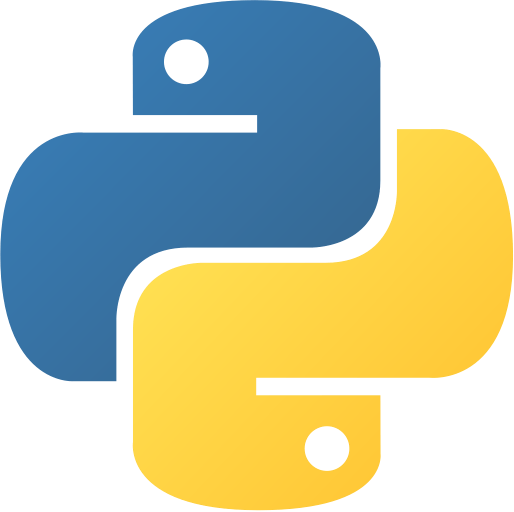

## Introducción

Estos no son más que un conjunto de apuntes para recordar o facilitar el cómo se desarrollan aplicaciones gráficas con Python y pyqt6. Estaré documentando el desarrollo por acá, mientras de manera paralela iré armando el proyecto en una carpeta separada.

## Preparando el entorno

Primero la instalación de lo necesario. Debido a que utilizo Manjaro Linux (y lo mismo aplica para cualquier derivada de Arch), es más recomendable instalar las librerías de Python directamente con el gestor de paquetes *Pacman*, al contrario de lo que en muchos tutoriales se sugiere.

```bash
sudo pacman -S python-qt6
```

Sin embargo, siempre resulta muy útil trabajar con entornos virtuales, en los cuales es posible instalar los paquetes necesarios de manera aislada. Una ventaja de este enfoque es evitar que tras las continuas actualizaciones de paquetes en Arch se rompan las dependencias de este proyecto, que se supone es algo más serio. As'que continúemos.


