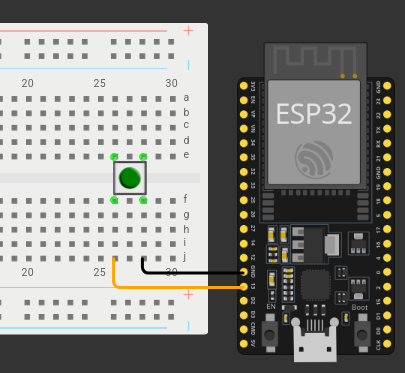

## Circuito

Estaremos utilizando un botón *switch* y leeremos su estado, imprimiéndolo mediante el monitor serial. Haremos uso de la propiedad *pull up* de los pines de la ESP32 para así prescindir de una resistencia en el circuito.



## Código

```cpp
const int boton = 13;

void setup() {
  Serial.begin(115200);
  pinMode(boton, INPUT_PULLUP);
}

void loop() {
  int estado_boton = digitalRead(boton);
  Serial.println(estado_boton);
}
```

