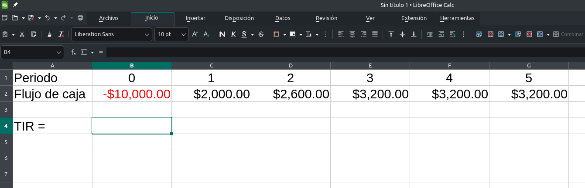
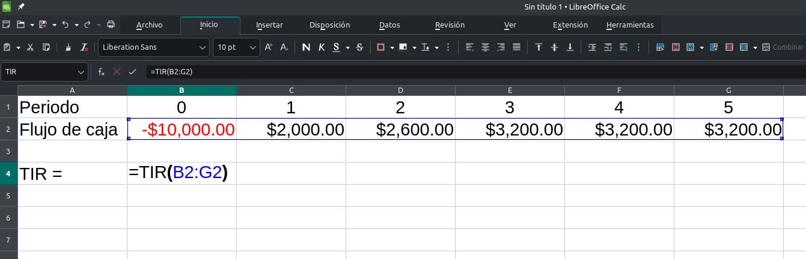

Pues eso, calcular la Tasa Interna de Retorno para evaluar un proyecto. Si bien ya no se recomienda tanto usar este criterio, aún es bastante popular. Calcular esta cosa a mano consiste en estar haciendo pruebas al tanteo hasta dar con el valor que vuelva $0$ al Valor Actual Neto en la siguiente fórmula:

$$
VAN=-I_0+ \sum^{t}_{n=1} \frac{F_{n}}{(1+TIR)^{n}}=0
$$

Pero no estamos aquí para hacerlo a mano. En hojas de cálculo resulta bastante fácil si tenemos ya a la mano los flujos de caja, desde el periodo 0 hasta el último a considerar:

|              |        |        |        |        |        |        |
|:-------------|-------:|-------:|-------:|-------:|-------:|-------:|
|Periodo       |    0   |  1     |  2     |  3     |  4     | 5      |
|Flujo de caja | -2,000 |2,000.00|2,600.00|3,200.00|3,200.00|3,200.00|

Los acomodamos así justo en una hoja de cálculo (yo uso LibreOffice Calc) para que quede

Y en la celda donde tengo el cursor inserto la función `=TIR(B2:G2)`, siendo `B2:G2` el rango de celdas en donde se encuentran mis datos.

Damos  y listo, debería darnos un valor del $11.95\%$.

