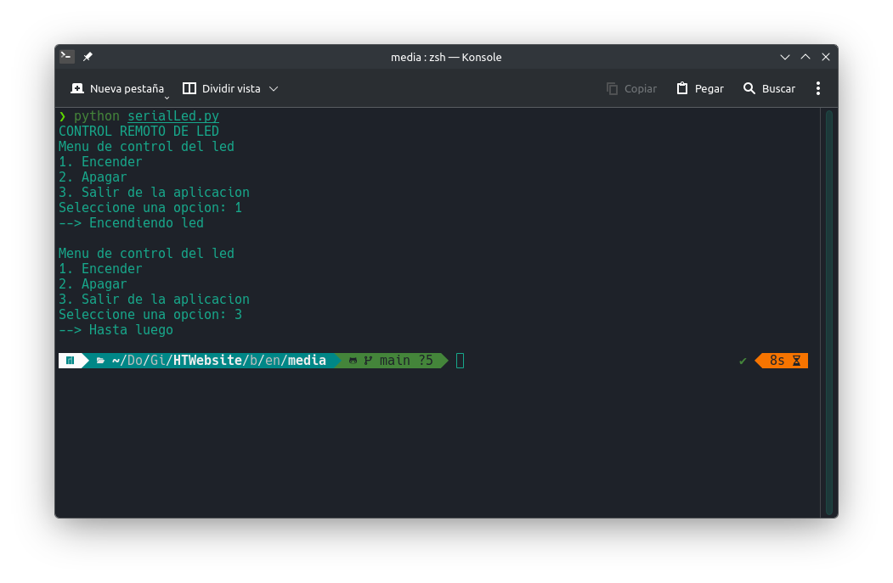

## Introducción

En la anterior entrada mandamos órdenes a la ESP32 por medio de comunicación serial para encender o apagar un led. En esta ocasión, dichas órdenes se emitirán por medio de una aplicación externa que se esté ejecutando en la PC.

## Circuito

Partiremos del circuito con led y resistencia que armamos justo en la entrada pasada.

## Código para la ESP32

Si hemos realizado justo antes la práctica del monitor serial, ya deberíamos tener el programa cargado en la placa. De todos modos lo repito aquí.

```cpp
/* Entradas y salidas */
#define led1 16          // GPIO16

/* Comandos */
#define luz_on 'H'       // Luz encendida
#define luz_off 'L'      // Luz apagada

int cmd = 0; // Comando entrado por serial

void setup() {
  // Configuración de los puertos digitales
  pinMode(led1, OUTPUT);
  digitalWrite(led1, LOW);
  // Configuracion del puerto serial
  Serial.begin(115200);

}

void loop() {
  // Responde solo si hay respuesta:
  if (Serial.available() > 0) {
    // Lee lo que esté presente:
    cmd = Serial.read();

    // Encendido o apagado de la luz segun el comando
    if(cmd == luz_on) {
      digitalWrite(led1, HIGH);
      Serial.println("Encendida");
    }
    else if(cmd == luz_off) {
      digitalWrite(led1, LOW);
      Serial.println("Apagada");
    }
  }
}
```

Con esto, cada vez que encendíamos la placa, podíamos escribir en la entrada serial el comando "H" para encender el led y "L" para apagarlo. Esta ocasión será diferente el modo de mandar dichos comandos.

## Aplicación externa

Primero debemos asegurarnos de tener instalada la librería `pyserial`.

```bash
pip install pyserial
```

Creamos un archivo serialLed.py y lo guardamos en cualquier carpeta que nos parezca adecuada. Enseguida copiamos y pegamos el código siguiente. Es importante que editemos el puerto para que coincida con el que está usando nuestra placa. Otra alternativa es descargar este archivo: [Aplicación para Linux](scripts/python/serialLed.py)

```python
import serial

# Cambiar el puerto COMx en Windows o /dev/ttyUSBx en Linux
ser = serial.Serial(port='COMx', baudrate=115200, timeout=.1)

def menu():
    print("Menu de control del led " )
    print("1. Encender" )
    print("2. Apagar" )
    print("3. Salir de la aplicacion" )

def luzON():
    ser.write(b'H')

def luzOFF():
    ser.write(b'L')


def main():
    print("CONTROL REMOTO DE LED")
    while True:
        menu()
        opc = input("Seleccione una opcion: ")
        if opc == '1':
            print("--> Encendiendo led\n")
            luzON()
        elif opc == '2':
            print("--> Apagando led\n")
            luzOFF()
        elif opc == '3':
            ser.close()
            print("--> Hasta luego\n")
            break
        else:
            print("--> OPCION INVALIDA\n")

if __name__ == "__main__":
    main()
```

Debemos tener la placa conectada a la computadora y Arduino IDE cerrado. En una terminal ejecutamos con `python serialLed.py` y debería aparecer el menú que desarrollamos. Toca probar su funcionamiento.

