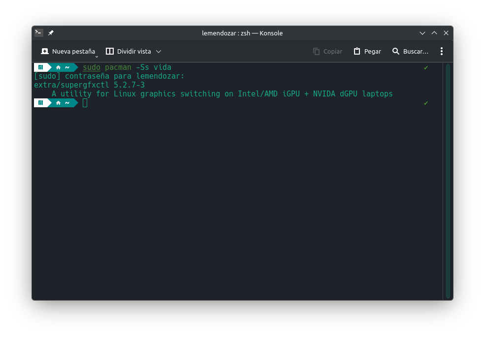

En ocasiones toca reinstalar todo el sistema operativo porque ya tenemos armado todo un desastre. Pero en otras simplemente corresponde hacer limpieza del sistema. Veamos cómo limpiar la caché de Pacman y eliminar los paquetes huérfanos (que son aquellos que no son dependencias de alguno más).

Bien, para borrar completamente la caché de *Pacman* (ya no permitirá instalar versiones anteriores de los programas, avisados quedamos), toca ejecutar esta sentencia en la terminal:

```bash
sudo pacman -Sc
```

Y si nos salta el aviso de que algo está bloqueado, pues toca:

```bash
sudo rm /var/lib/pacman/db.lck
```

Aunque muchas veces basta con simplemente esperar un rato. Por otro lado, si lo que queremos es saber si tenemos paquetes huérfanos, ejecutamos primero esto:

```bash
sudo pacman -Qtdq
```

Sabiendo que sí tenemos, entonces los eliminamos con:

```bash
sudo pacman -Rsn $(pacman -Qtdq)
```

Y ya. Cabe recordar que todo esto es para fines de limpieza y pues que sepamos lo que estamos haciendo.
