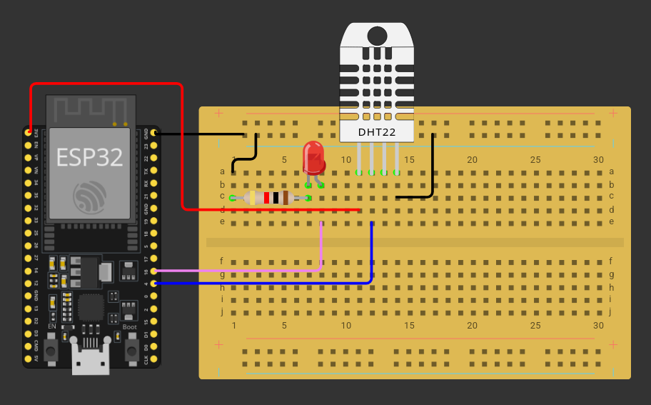

## Introducción

Esta práctica nos permitirá obtener la temperatura y la humedad del entorno mediante un sensor DHT11 para luego mostrarlas a través de BLE.

## Circuito



Necesitamos verificar si el sensor viene ya en un módulo o por sí solo. En la compra por kits, dicho sensor se presenta de la primera forma, lo cual nos ahorra el tener que agregar una resistencia de $10k \Omega$. Si por alguna razón viene "suelto", entonces sí debemos agregar dicha resistencia haciendo puente entre el voltaje y la señal.

El sensor se conecta a los $3.3V$ de la placa, mientras que la señal se conecta al pin 4. Por último, la tierra a cualquier GND de la esp32. También agregaremos el circuito básico de led, para mostrar el estado de la conexión, ya que este encenderá cuando se haya conectado un cliente.

Lo siguiente es instalar lo necesario, lo cual lo abordo enseguida.

## Código

Antes de cargar nada, debemos instalar la librería que el sensor requiere, para lo cual nos vamos al *Gestor de bibliotecas* que se encuentra en el panel izquierdo (su icono trata de hacer referencia a unos libros apilados y es el tercero de arriba abajo, aunque no lo distingo como tales). Ahí tendremos una caja de texto en la que buscaremos `dht sensor adafruit` y nos instalamos la librería que haya sido subida precisamente por Adafruit. Al pedirnos si instalamos las dependencias, le decimos que sí y aceptamos.

Después de haber instalado la librería y verificar que así haya sido en la terminal de Arduino IDE, pasamos a cargar el siguiente código:

```cpp
#include <BLEDevice.h>
#include <BLEServer.h>
#include <BLEUtils.h>
#include <BLE2902.h>
#include <DHT.h>

// Configurando el sensor
#define DHTPIN 4            // GPIO donde esta conectado el DHT11
#define DHTTYPE DHT11       // TIPO DE SENSOR: DHT11

DHT dht(DHTPIN, DHTTYPE);

// Configurando BLE
// Servicio de sensado de entorno (UUID Estandar)
#define SERVICE_UUID         "181A"  // Environmental Sensing Service
#define TEMP_UUID       "2A6E"  // Temperatura (caracteristica estandar)
#define HUM_UUID      "2A6F"  // Humedad (caracteristica estandar)

// Nombre visible del dispositivo
#define DEVICE_NAME          "CambiarNombre"

// Intervalo de lectura del sensor (ms)
// El DHT11 requiere al menos 2000ms entre lecturas
#define SENSOR_READ_INTERVAL 5000  // 5 segundos

// Variables
BLEServer* pServer = NULL;
BLECharacteristic* pTempCharacteristic = NULL;
BLECharacteristic* pHumidCharacteristic = NULL;
bool deviceConnected = false;

// Almacenar ultimos valores leidos
float lastTemperature = 0.0;
float lastHumidity = 0.0;
unsigned long lastSensorRead = 0;

// LED indicador (opcional)
const int pinEstadoLed = 16;
bool estadoLed = false;

// Callbacks
class MyServerCallbacks: public BLEServerCallbacks {
  void onConnect(BLEServer* pServer) override {
    deviceConnected = true;
    Serial.println("Cliente BLE conectado");
    digitalWrite(pinEstadoLed, HIGH);
  }

  void onDisconnect(BLEServer* pServer) override {
    deviceConnected = false;
    Serial.println("Cliente BLE desconectado");
    digitalWrite(pinEstadoLed, LOW);

    // Reiniciar advertising para permitir nuevas conexiones
    delay(500);
    pServer->startAdvertising();
    Serial.println("Reanudando advertising...");
  }
};

// Sensor DHT11
bool readDHT11Sensor(float& temperature, float& humidity) {
  // Leer el sensor
  temperature = dht.readTemperature();
  humidity = dht.readHumidity();

  // Verificar si la lectura fue exitosa
  // isnan() verifica si el valor es "Not a Number" (error de lectura)
  if (isnan(temperature) || isnan(humidity)) {
    Serial.println("Error: No se pudo leer el sensor DHT11");
    Serial.println("Verifica las conexiones y que el sensor este alimentado");
    return false;
  }

  // El DHT11 no mide temperaturas negativas (rango 0-50°C)
  // Si se lee un valor fuera de rango, el sensor puede devolver datos erroneos

  return true;
}

void updateBLECharacteristics(float temperature, float humidity) {
  if (!deviceConnected) {
    return;  // No hay cliente conectado, no enviar datos
  }

  // Convertir temperatura a entero para BLE (formato estandar)
  // En BLE, la temperatura se suele enviar como entero con resolucion de 0.01°C
  int16_t tempInt = (int16_t)(temperature * 100);

  // Convertir humedad a entero (resolucion 0.01%)
  uint16_t humInt = (uint16_t)(humidity * 100);

  // Enviar temperatura
  pTempCharacteristic->setValue((uint8_t*)&tempInt, 2);
  pTempCharacteristic->notify();

  // Enviar humedad
  pHumidCharacteristic->setValue((uint8_t*)&humInt, 2);
  pHumidCharacteristic->notify();

  Serial.println("Datos enviados por BLE");
  Serial.print("  Temperatura (int): ");
  Serial.println(tempInt);
  Serial.print("  Humedad (int): ");
  Serial.println(humInt);
}

// Funcion para formatear valores como String (para debug)
String formatSensorData(float temperature, float humidity) {
  String data = "Temp: ";
  data += String(temperature, 1);
  data += " C | Hum: ";
  data += String(humidity, 1);
  data += " %";
  return data;
}


void setup() {
  Serial.begin(115200);

  // Configurar LED de estado
  pinMode(pinEstadoLed, OUTPUT);
  digitalWrite(pinEstadoLed, LOW);

  // Inicializar el sensor DHT11
  Serial.println("Inicializando sensor DHT11...");
  dht.begin();

  // Verificar que el sensor responda
  delay(2000);  // Primer delay para estabilizar el sensor
  float testTemp, testHum;
  if (readDHT11Sensor(testTemp, testHum)) {
    Serial.println("Sensor DHT11 inicializado correctamente");
    Serial.print("  Lectura inicial - Temperatura: ");
    Serial.print(testTemp);
    Serial.print(" C, Humedad: ");
    Serial.print(testHum);
    Serial.println(" %");
  } else {
    Serial.println("No se detectó el sensor DHT11");
  }

  // Inicializar BLE
  Serial.println("Inicializando BLE...");
  BLEDevice::init(DEVICE_NAME);

  // Crear servidor BLE
  pServer = BLEDevice::createServer();
  pServer->setCallbacks(new MyServerCallbacks());

  // Crear el servicio (UUID estandar 0x181A)
  BLEService* pService = pServer->createService(SERVICE_UUID);

  // Caracteristica para temperatura (UUID estandar 0x2A6E)
  pTempCharacteristic = pService->createCharacteristic(
    TEMP_UUID,
    BLECharacteristic::PROPERTY_READ |
    BLECharacteristic::PROPERTY_NOTIFY
  );
  pTempCharacteristic->addDescriptor(new BLE2902());  // Necesario para notifications

  // Caracteristica para humedad (UUID estandar 0x2A6F)
  pHumidCharacteristic = pService->createCharacteristic(
    HUM_UUID,
    BLECharacteristic::PROPERTY_READ |
    BLECharacteristic::PROPERTY_NOTIFY
  );
  pHumidCharacteristic->addDescriptor(new BLE2902());

  // Iniciar servicio
  pService->start();

  // Configurar advertising
  BLEAdvertising* pAdvertising = pServer->getAdvertising();
  pAdvertising->addServiceUUID(SERVICE_UUID);
  pAdvertising->start();

  Serial.println("BLE inicializado correctamente");
  Serial.print("  Nombre del dispositivo: ");
  Serial.println(DEVICE_NAME);
  Serial.print("  Servicio UUID: ");
  Serial.println(SERVICE_UUID);

  Serial.println();
  Serial.println("Sistema listo");
  Serial.println("1. Abrir nRF Connect en el teléfono");
  Serial.println("2. Escanear y conectarse a CambiarNombre");
  Serial.println("3. Buscar el servicio Environmental Sensing (0x181A)");
  Serial.println("4. Leer las caracteristicas de temperatura y humedad");
  Serial.println();
}

void loop() {
  unsigned long currentMillis = millis();

  // Leer el sensor cada SENSOR_READ_INTERVAL milisegundos
  if (currentMillis - lastSensorRead >= SENSOR_READ_INTERVAL) {
    lastSensorRead = currentMillis;

    // Leer el DHT11
    float temperature, humidity;
    if (readDHT11Sensor(temperature, humidity)) {
      // Actualizar variables globales
      lastTemperature = temperature;
      lastHumidity = humidity;

      // Mostrar en Monitor Serie
      Serial.print("Lectura de sensor: ");
      Serial.println(formatSensorData(temperature, humidity));

      // Si hay un cliente conectado, enviar datos por BLE
      if (deviceConnected) {
        updateBLECharacteristics(temperature, humidity);
        Serial.println("  (Datos enviados a cliente BLE)");
      } else {
        Serial.println("  (Sin cliente BLE conectado)");
      }

      // Parpadeo del LED indicador de lectura exitosa
      estadoLed = !estadoLed;
      digitalWrite(pinEstadoLed, estadoLed);
      delay(50);
      digitalWrite(pinEstadoLed, deviceConnected ? HIGH : LOW);

    } else {
      Serial.println("Error en lectura del sensor - reintentando en el proximo ciclo");
    }
  }

  // Pequena pausa para no saturar el CPU
  delay(100);
}
```

Toca probar con la aplicación `nRF Connect` y seguir las instrucciones mostradas en el monitor.
