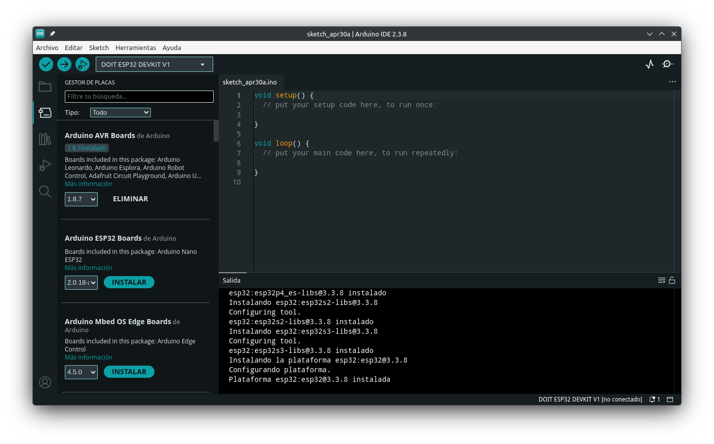

Si ya te decidiste a desarrollar tus prácticas con la ESP32, pero no te quieres agobiar con su propio *framework*, puedes optar por programarla en *Arduino IDE* y con `C++`. Sin embargo, no es algo tan simple como conectar y ya. Debe prepararse tu entorno de desarrollo. Pasemos a ello.

## Placas soportadas

Prácticamente todas, pero un par de ellas con un matiz: la *C2* y la *C61* requieren reconstruir las bibliotecas estáticas. Si tu placa no es una de ellas, podemos continuar.

## Arduino IDE

1. Lo primero es descargar e instalar Arduino IDE desde la página oficial de [Descargas](https://www.arduino.cc/en/software/) de Arduino, que al momento de escribir esta entrada iba en la versión 2.3.8. Al ejecutarlo por primera vez comenzará a descargar e instalar librerías y demás. Es normal.

2. Enseguida nos vamos al menú *File -> Preferences*, lo que abrirá una nueva ventana en la que podemos modificar la carpeta en la que se estarán guardando los archivos que vayamos generando, además del tema y el lenguaje. En lo personal, prefiero cambiar la carpeta y el idioma.

::: {.callout-note}
## Importante
A partir de este momento, todas las referencias a la interfaz de Arduino IDe estarán en español.
:::

3. Lo importante está al final de la ventana: hay una caja de texto que dice "URLs adicionales de gestor de placas" y en la cual podemos pegar cualquiera de las direcciones de las cuales sacaremos los archivos necesarios:

```bash
# Versión estable
https://espressif.github.io/arduino-esp32/package_esp32_index.json
```

```bash
# Versión en desarrollo
https://espressif.github.io/arduino-esp32/package_esp32_dev_index.json
```

Incluso si queremos pegar ambas, las separamos con una coma. Aunque no es muy recomendable hacerlo. Damos clic en *Aceptar*.

4. Nos vamos al menú *Herramientas -> Placa -> Gestor de placas* y veremos aparecer un panel a la izquierda del programa. Ahí tendrá su propia caja de búsqueda. Escribimos esp32 y nos instalamos la subida por Espressif Systems, que a abril de 2026 va en la versión 3.3.8. El proceso de instalación puede ser tardado. Una vez que haya terminado nos avisará de ello.

5. Lo siguiente es buscar y seleccionar nuestra placa en el menú *Herramientas -> Placa -> esp32*. Muy probablemente no encontremos nuestro modelo específico, pero algunos funcionan muy bien con los que normalmente se consiguen en el país. Uno es *DOIT ESP32 DEVKIT V1*.

6. Conectamos la placa a la computadora y esta debería ser reconocida. Si no, muy probablemente la instalación automática de los controladores en Windows no funcionó. Toca instalarlos manualmente.

::: {.callout-note}
## Controladores para Windows
Se obtienen en el sitio de [Silicon Labs](https://www.silabs.com/software-and-tools/usb-to-uart-bridge-vcp-drivers?tab=downloads), siendo suficiente el comprimido *CP210x Universal Windows Drivers*. En este se encuentra un archivo llamado `silabser.inf`. Darle clic derecho y luego *Instalar*.
:::

7. Una vez reconocida, ya podemos subir nuestros programas a la placa. En una posterior entrada encenderemos un led con ella.

Si deseas desarrollar en microPython para esta placa, la siguiente entrada aborda el proceso de preparación del entorno.



