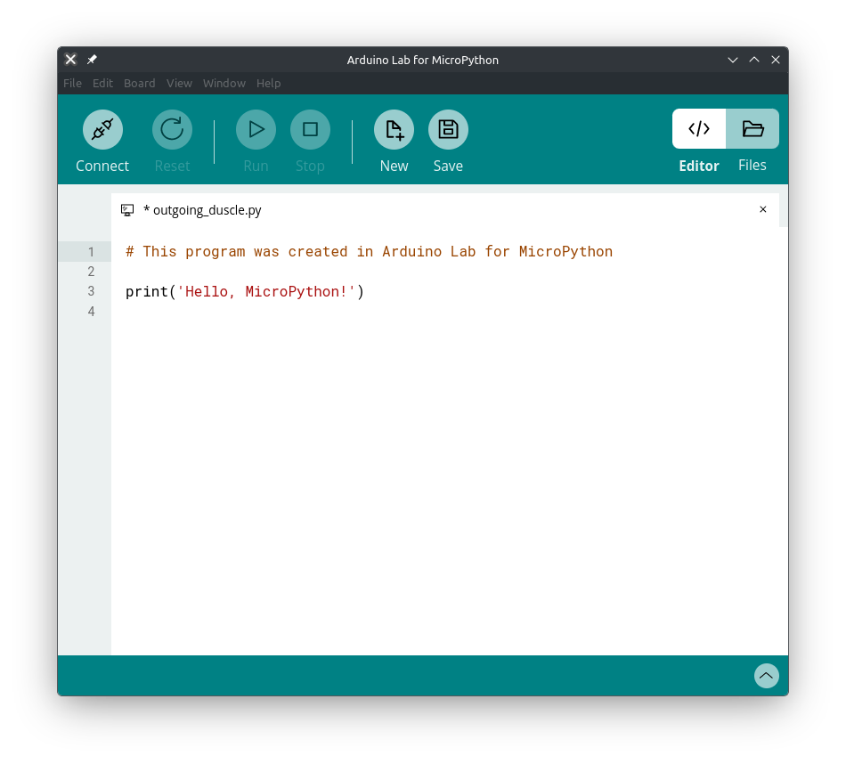

## Windows

Para poder desarrollar nuestras aplicaciones embebidas con microPython en Windows necesitamos tener los controladores UART para la PC y Python instalado tanto en la misma como en la placa ESP32.

### Controladores UART

Se obtienen en el sitio de [Silicon Labs](https://www.silabs.com/software-and-tools/usb-to-uart-bridge-vcp-drivers?tab=downloads), siendo suficiente el comprimido *CP210x Universal Windows Drivers*. En este se encuentra un archivo llamado `silabser.inf`. Darle clic derecho y luego *Instalar*.

### Python

Lo primero se consigue descargando el instalador en [python.org](https://www.python.org/downloads/). Una vez instalado, podemos instalar la siguiente herramienta.

### ESPtool

En la terminal (el CMD en Windows) escribimos el comando

```bash
pip install esptool
```

Cabe mencionar que en ocasiones este comando no funciona, por lo que tocará buscar otras alternativas, del estilo de:

```bash
python.exe -m install esptool
```

## Linux

Python viene instalado por defecto en la mayoría de las distribuciones Linux, por lo que solo será necesario instalar `esptool`, lo cual dependerá de la distro en sí. En el caso de ArchLinux y derivadas basta con

```bash
sudo pacman -S esptool
```

## MicroPython

### Detectando la placa

Conectamos la ESP32 a la PC y nos aseguramos que ha sido detectada. En Windows podemos verlo en el *Gestor de Dispositivos -> Puertos*, típicamente estando en los `COMx` (siendo `x` un número).

En Linux hay que escribir en la terminal

```bash
lsusb
```

Entonces nos dirigimos al sitio de descargas de [microPython] (https://micropython.org/download/?port=esp32) y elegimos el binario correspondiente a nuestra placa. Típicamente es la ESP32/WROOM, pero debemos verificar con la imagen de referencia que el mismo sitio coloca. Descargamos el *firmware* más reciente y lo dejamos en la carpeta que nos parezca más adecuada.

### Borrando el *firmware*

Después debemos borrar la memoria flash de la placa. Basta con escribir en la terminal de Windows:

```bash
esptool.py erase-flash
```

O en Linux:

```bash
esptool erase-flash
```

Es probable que en Linux debamos hacerlo con permisos de superusuario. Además, si ocurre un error de escritura, sobretodo si la placa es nueva, debemos habilitar el modo escritura, lo cual se logra presionando el botón `BOOT` de la misma cuando aparezca el mensaje `Connecting...` y soltarlo cuando ya haya comenzado a escribir.

Si no es encontrada la placa, podemos forzar la escritura del comando agregando el parámetro `--port COMx`:

```bash
esptool.py --port COMx erase-flash
```

### Instalando microPython en la placa

Estando en la terminal, nos dirigimos a la carpeta en la que dejamos el firmware descargado y procedemos a instalarlo en la placa. Escribimos el comando

```bash
esptool.py --baud 460800 write-flash 0x1000 ESP32_GENERIC-20260406-v1.28.0.bin
```

Es probable que la versión de microPython haya cambiado, por lo que el nombre del archivo difiera del mostrado (`ESP32_GENERIC-20260406-v1.28.0.bin`).

## El IDE

En sí no existe un buen IDE para microPython, pero uno que resulta aceptable es *Arduino Lab for microPython*, del cual puede descargarse un portable desde su [sitio](https://labs.arduino.cc/en/labs/micropython).

Una vez descargado, descomprimimos y ejecutamos. Lo primero que hará será preguntarnos en dónde queremos guardar los archivos que vayamos generando. Es importante tener en cuenta que deberíamos crear una carpeta para cada proyecto, ya que los archivos que estaremos enviando a la placa se llaman indistintamente `main.py`.

Elegimos la ubicación y, si tenemos conectada la placa a la PC, podemos optar por presionar el botón *Conectar* y esperar a que aparezca el diálogo que nos da a elegir el puerto en el que se encuentra la placa. Si todo se realiza bien, ya estaremos en condiciones de ejecutar nuestros programas en la ESP32 con microPython.

Probablemente en Linux surjan problemas de permisos. En Arch y derivadas se resuelve reiniciando después de ejecutar el siguiente comando en consola (donde `usuario` es el nombre de quien inicia la sesión en Linux):

```bash
sudo usermod -a -G uucp <usuario>
```

Ya estaremos en condiciones de subir nuestros programas a la placa, lo cual abordaremos en la siguiente entrada.




