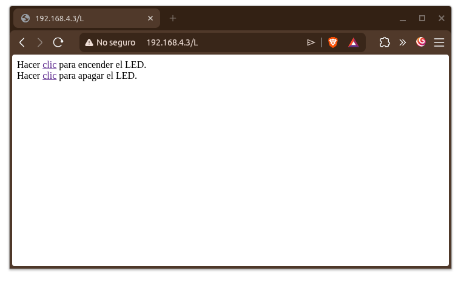

## Introducción

Es posible utilizar la esp32 como un punto de acceso (AP), así otros dispositivos pueden conectarse a ella mediante la red que crea. Veamos cómo.

## Circuito

Podemos partir del mismo circuito que hemos armado con un led y su respectiva resistencia. El punto importante es que utilizaremos dos placas esp32 para esta práctica. El circuito estará conectado a una de ellas, reservando la otra para crear el punto de acceso.

## Consideraciones

Se sugiere que primero hagamos una prueba de conectividad para corroborar que todo funciona correctamente en ambas placas. En Arduino IDE, nos dirigimos a *Archivo -> Ejemplos -> WiFi -> WiFiScan*. Esto nos abrirá un nuevo script. Lo cargamos en ambas placas y verificamos mediante el monitor serial que efectivamente hayan encontrado algunas redes inalámbricas que estén disponibles.

Una vez que hayamos comprobado que las placas pueden detectar redes WiFi, pasamos a la siguiente etapa. Una de ellas se mantendrá en modo **Estación** (STA, es decir, se conectará al AP) para convertirla en un servidor que controlará un led, mientras la otra la volveremos punto de acceso y creará una red local a la que nos conectaremos. Seguiremos utilizando nuestra computadora para enviar peticiones por medio del AP, por lo que será el cliente en esta red.

## Código del AP

Seleccionamos en Arduino IDE la esp32 que usaremos como AP y cargamos el siguiente código:

```cpp
#include <WiFi.h>
#include <WiFiAP.h>

bool led_on = false;
String inputString = "";

const char *ssid = "RED-AP";
const char *password = "PASSWD-AP";

void setup() {
  pinMode(LED_BUILTIN, OUTPUT);
  Serial.begin(115200);
  Serial.println();
  Serial.println("Configurando punto de acceso...");

  WiFi.softAP(ssid, password);

  IPAddress AP_IP = WiFi.softAPIP();
  Serial.print("Dirección IP del AP: ");
  Serial.println(AP_IP);
  Serial.println();
  Serial.println("Comandos disponibles:");
  Serial.println("  'ip'  - Muestra la IP del AP");
  Serial.println("  'sta' - Muestra número de clientes conectados");
  Serial.println("  'ver' - Muestra configuración actual");
}

void loop() {
    // Verificar comandos por serial
    while (Serial.available()) {
        char inChar = (char)Serial.read();
        inputString += inChar;

        if (inChar == '\n') {
            inputString.trim();  // Eliminar espacios y saltos de línea

            if (inputString == "ip") {
                Serial.print("IP del AP: ");
                Serial.println(WiFi.softAPIP());
            }
            else if (inputString == "sta") {
                Serial.print("Clientes conectados: ");
                Serial.println(WiFi.softAPgetStationNum());
            }
            else if (inputString == "ver") {
                Serial.println("=== CONFIGURACIÓN AP ===");
                Serial.print("SSID: ");
                Serial.println(ssid);
                Serial.print("IP: ");
                Serial.println(WiFi.softAPIP());
                Serial.print("MAC: ");
                Serial.println(WiFi.softAPmacAddress());
                Serial.print("Canal: ");
                Serial.println(WiFi.channel());
                Serial.print("Clientes: ");
                Serial.println(WiFi.softAPgetStationNum());
            }
            else if (inputString.length() > 0) {
                Serial.println("Comando no reconocido. Usar: ip, sta, ver");
            }

            inputString = "";
        }
    }

    // Mostrar cambios en conexiones
    static int last_stations = -1;
    int current_stations = WiFi.softAPgetStationNum();

    if (current_stations != last_stations) {
        Serial.print("Conexiones: ");
        Serial.println(current_stations);
        if (current_stations > 0) {
            Serial.println("Usar 'ip' para ver la dirección del AP");
        }
        last_stations = current_stations;
    }

    // Parpadeo del LED (menos frecuente para no saturar)
    static unsigned long last_toggle = 0;
    if (millis() - last_toggle > 500) {
        digitalWrite(LED_BUILTIN, led_on ? HIGH : LOW);
        led_on = !led_on;
        last_toggle = millis();
    }
}
```

O bien, se puede descargar el script desde [aquí](scripts/puntoAcceso.ino).

Una vez cargado el código, abrimos el monitor serial y confirmamos que se encuentre mostrando el número de conexiones (serán cero), los comandos disponibles y la dirección IP del punto de acceso. Además, el led integrado debe parpadear.

## Código del servidor

Ahora abrimos otra ventana de Arduino IDE y cargamos este código en la otra esp32:

```cpp
/*
 puntoAcceso.ino crea un punto de acceso WiFi y servidorLED.ino proporciona un servidor web en él.

  Pasos:
  1. Conectarse al punto de acceso "RED-AP"
  2. Apuntar el navegador web a http://IP_ESP32/H para encender el LED o a http://IP_ESP32/L para apagarlo
     O
     Ejecutar TCP raw "GET /H" y "GET /L" en la terminal PuTTY con 192.168.4.1 como dirección IP y 80 como puerto
*/

#include <WiFi.h>
#include <WiFiClient.h>

// Establecer las credenciales deseadas.
const char *ssid = "RED-AP";
const char *password = "PASSWD-AP";

// Establecer el puerto del servidor web a 80
WiFiServer server(80);

// Declarar pin del led
const int led = 16;

void setup() {
  pinMode(led, OUTPUT);
  Serial.begin(115200);
  Serial.println();
  Serial.print("Conectando a ");

  // Conectarse a la red WiFi con SSID y contraseña
  WiFi.begin(ssid, password);
  while (WiFi.status() != WL_CONNECTED) {
    delay(500);
    Serial.print(".");
  }

  IPAddress myIP = WiFi.localIP();
  Serial.print("Conectado con la dirección IP asignada: ");
  Serial.println(myIP);
  server.begin();
  Serial.println("Servidor iniciado en puerto 80");
  Serial.print("Accede desde el navegador en: http://");
  Serial.println(myIP);
}

void loop() {
  WiFiClient client = server.available();   // Escuchar clientes entrantes

  if (client) {                             // Si se recibe un cliente,
    Serial.println("Nuevo Cliente.");       // Imprimir un mensaje en el puerto serie
    String currentLine = "";                // Crear un String para almacenar datos entrantes del cliente
    while (client.connected()) {            // Bucle mientras el cliente esté conectado
      if (client.available()) {             // Si hay bytes para leer del cliente,
        char c = client.read();             // Leer un byte
        Serial.write(c);                    // Imprimirlo en el monitor serie
        if (c == '\n') {                    // Si el byte es un carácter de nueva línea

          // Si la línea actual está vacía, se obtuvieron dos caracteres de nueva línea consecutivos.
          // Ese es el final de la petición HTTP del cliente, por lo que se envía una respuesta:
          if (currentLine.length() == 0) {
            // Las cabeceras HTTP siempre comienzan con un código de respuesta (ej. HTTP/1.1 200 OK)
            // y un tipo de contenido para que el cliente sepa lo que viene, luego una línea en blanco:
            client.println("HTTP/1.1 200 OK");
            client.println("Content-type:text/html");
            client.println();

            // El contenido de la respuesta HTTP sigue a la cabecera:
            client.print("Hacer <a href=\"/H\">clic</a> para encender el LED.<br>");
            client.print("Hacer <a href=\"/L\">clic</a> para apagar el LED.<br>");

            // La respuesta HTTP termina con otra línea en blanco:
            client.println();
            // Salir del bucle while:
            break;
          } else {    // Si se recibió una nueva línea, entonces limpiar currentLine:
            currentLine = "";
          }
        } else if (c != '\r') {  // Si se recibió cualquier cosa excepto un retorno de carro,
          currentLine += c;      // Añadirlo al final de currentLine
        }

        // Verificar si la petición del cliente fue "GET /H" o "GET /L":
        if (currentLine.endsWith("GET /H")) {
          digitalWrite(led, HIGH);               // GET /H enciende el LED
        }
        if (currentLine.endsWith("GET /L")) {
          digitalWrite(led, LOW);                // GET /L apaga el LED
        }
      }
    }
    // Cerrar la conexión:
    client.stop();
    Serial.println("Cliente desconectado.");
  }
}
```

El script puede descargarse desde este [enlace](scripts/servidorLED.ino).

El monitor serial de cada placa nos brindará información importante, como la IP del punto de acceso o la dirección a la que debemos apuntar con el navegador de nuestra computadora. Si todo ha sucedido bien, aparecerá un sitio web muy básico con un par de vínculos. Al dar clic en ellos podremos alterar el estado del led.
