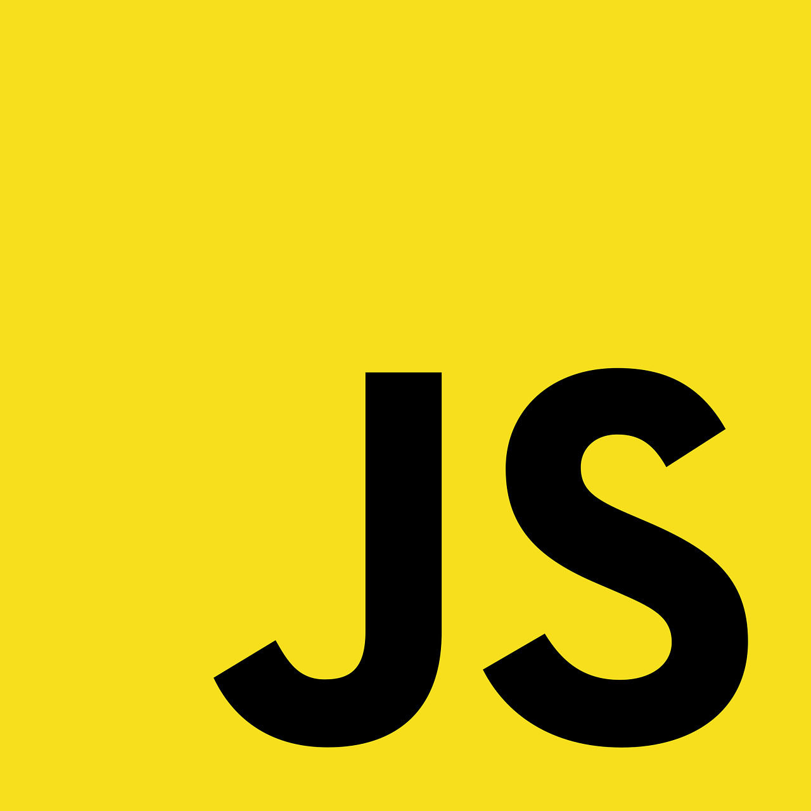

Crearemos un juego para el aprendizaje de conceptos, que bien podría ser un lenguaje nuevo. Por ejemplo, mostraremos una palabra en el idioma que queremos aprender y enseguida pondremos diferentes opciones para que el usuario presione la que considere correcta. Agregaremos un poco de funcionalidad, así que comencemos con los dos archivos de siempre, un `index.html` y `script.js`.

## La página HTML: la pregunta

Comencemos con la estructura de la página para mostrar las preguntas y las posibles respuestas. Dentro de `index.html` colocaremos los elementos HTML **DOM** (Document Object Model), así como la referencia al script.

Pondremos un identificador único dentro del `<div>`, una lista sin orden `<ul>` que englobará los elementos de lista `li` que representarán los cuatro elementos que queremos mostrar como opciones. Por último, hacemos la referencia al script:

```html
<div id="nombre"></div>
<ul>
    <li class="opcion"></li>
    <li class="opcion"></li>
    <li class="opcion"></li>
    <li class="opcion"></li>
</ul>

<script src="script.js"></script>
```

Los **DOM** conectan la página con el código JavaScript, mientras en el script  usamos métodos DOM sobre el documento para seleccionar los elementos. Trabajar con los DOM consiste en dos pasos: seleccionar el elemento DOM y entonces modificarlo.

## JavaScript: la pregunta

Nos vamos al script y creamos un objeto JavaScript con la sintaxis `let` + la variable + llaves, el cual puede contener cualquier número de combinaciones *propiedad: valor*:

```javascript
// Definimos el objeto para la pregunta
let pregunta = {
    nombre: "cat",
    opciones: ["perro", "gato", "pájaro", "pescado"],
    correcta: 1
};
```

Con esto asignamos tres propiedades a la variable `pregunta`: el texto que hará de título de la pregunta, el arreglo que incluye todas las opciones y el índice que señala la respuesta correcta.

### Función para mostrar la pregunta

Una buena forma de mantener algo de orden es manejar una función que muestre la pregunta al llamarla con la propia pregunta como argumento, representada por el parámetro `q`. Agregamos lo siguiente a nuestro script:

```javascript
// Función que muestra la pregunta
function mostrarPregunta(q) {
    // algo
}

// Llamar la función
mostrarPregunta(pregunta);
```

### Mostrar la pregunta

En nuestro caso, la palabra a preguntar es almacenada en el objeto `pregunta` bajo una propiedad de texto llamada `nombre`. En el HTML representamos la palabra a preguntar como un `<div>` con un `id` de nombre. Dentro de la función `mostrarPregunta` agregamos la lógica para seleccionar (mediante `getElementById`) y modificar este elemento DOM (con la propiedad `textContent`):

```javascript
// Función que muestra la pregunta
function mostrarPregunta(p) {
    let nombreDiv = document.getElementById("nombre");
    nombreDiv.textContent = p.nombre;
}
```

Guardamos y abrimos la página en el navegador. Debería mostrar la pregunta y los espacios de las opciones.

## JavaScript: las opciones

Para mostrar las opciones de respuesta dejaremos la función `mostrarPregunta` como sigue:

```javascript
// Función que muestra la pregunta
function mostrarPregunta(p) {
    let nombreDiv = document.getElementById("nombre");
    nombreDiv.textContent = p.nombre;

    let alts = document.querySelectorAll(".opcion");
    console.log(alts);
    alts.forEach(function(element, index) {
        element.textContent = p.opciones[index];
    });
}
```

## Aceptando los clics

Tenemos que agregar un detector de eventos para cada elemento de nuestra lista. Para ello, asignaremos a cada elemento un identificador, entonces seleccionaremos y agregaremos los detectores uno por uno. Así que toca editar de nuevo la función `mostrarPregunta`:

```javascript
// Función que muestra la pregunta
function mostrarPregunta(p) {
    let nombreDiv = document.getElementById("nombre");
    nombreDiv.textContent = p.nombre;

    let alts = document.querySelectorAll(".opcion");
    alts.forEach(function(element, index) {
        element.textContent = p.opciones[index];
        element.addEventListener("click", function() {
            if (p.correcta == index) {
                console.log("Correcto");
            }
            else {
                console.log("Incorrecto");
            }
        });
    });
}
```

## Código final

```javascript
// Definimos el objeto para la pregunta
let pregunta = {
    nombre: "cat",
    opciones: ["perro", "gato", "pájaro", "pescado"],
    correcta: 1
};

// Función que muestra la pregunta
function mostrarPregunta(p) {
    let nombreDiv = document.getElementById("nombre");
    nombreDiv.textContent = p.nombre;

    let alts = document.querySelectorAll(".opcion");
    alts.forEach(function(element, index) {
        element.textContent = p.opciones[index];
        element.addEventListener("click", function() {
            if (p.correcta == index) {
                console.log("Correcto");
            }
            else {
                console.log("Incorrecto");
            }
        });
    });
}

// Llamar la función
mostrarPregunta(pregunta);
```

Con esto la consola ya debe mostrar el resultado del clic sobre el texto, aunque no necesariamente parezca que el clic funcione, visualmente hablando. Sin embargo, esta arquitectura no es la mejor, ya que funciona bien para una sola pregunta. En el momento que queramos agregar más, tendremos que incluir detectores de eventos cada vez. Corrijamos esto en una entrada posterior.
