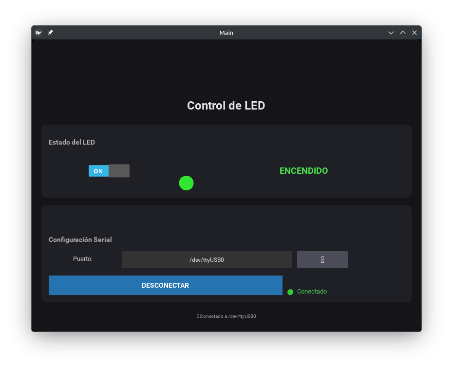

## Introducción

En la anterior entrada mandamos órdenes a la ESP32 por medio de comunicación serial y una aplicación externa desarrollada en python para encender o apagar un led. En esta ocasión, dichas órdenes se emitirán por medio de otra aplicación externa que no se ejecutará desde la terminal, si no que tendrá su respectiva interfaz gráfica.

## Circuito

Partiremos del circuito con led y resistencia que armamos justo en la entrada pasada.

## Código para la ESP32

Exactamente el mismo que para la práctica anterior.

## Aplicación externa

Primero debemos asegurarnos de tener instalada la librería `kivy`. Por ejemplo, para Windows se sugiere:

```bash
pip install "kivy[base]" kivy_examples
```

Y para ArchLinux:

```bash
sudo pacman -S python-kivy
```

Estamos partiendo del supuesto de que las anteriores prácticas han funcionado correctamente. Creamos un archivo llamado serialLedGUI.py y pegamos el siguiente código:

```python
# -*- coding: utf-8 -*-

import sys
import glob
import serial
from serial.tools import list_ports
import time

from kivy.app import App
from kivy.uix.boxlayout import BoxLayout
from kivy.uix.gridlayout import GridLayout
from kivy.uix.button import Button
from kivy.uix.label import Label
from kivy.uix.switch import Switch
from kivy.uix.spinner import Spinner
from kivy.uix.widget import Widget
from kivy.graphics import Color, RoundedRectangle, Ellipse, Rectangle
from kivy.core.text import LabelBase
from kivy.logger import Logger
from kivy.clock import Clock
from kivy.utils import get_color_from_hex

class LEDIndicator(Widget):
    """Indicador LED circular personalizado"""
    def __init__(self, **kwargs):
        super().__init__(**kwargs)
        self.size_hint = (None, None)
        self.size = (30, 30)
        self._color = (0.3, 0.3, 0.3, 1)  # Color apagado por defecto
        self.bind(pos=self._update, size=self._update)
        self._draw()

    def _draw(self):
        self.canvas.clear()
        with self.canvas:
            Color(*self._color)
            Ellipse(pos=self.pos, size=self.size)

    def _update(self, *args):
        self._draw()

    def set_color(self, color):
        """Cambiar color del LED: color en formato (r,g,b,a)"""
        self._color = color
        self._draw()

    def set_on(self, is_on):
        """Método rápido para encender/apagar"""
        if is_on:
            self.set_color((0.2, 0.9, 0.2, 1))  # Verde brillante
        else:
            self.set_color((0.3, 0.3, 0.3, 1))  # Gris apagado

class StatusIndicator(Widget):
    """Indicador de estado de conexión circular"""
    def __init__(self, **kwargs):
        super().__init__(**kwargs)
        self.size_hint = (None, None)
        self.size = (12, 12)
        self._color = (0.5, 0, 0, 1)  # Rojo apagado
        self.bind(pos=self._update, size=self._update)
        self._draw()

    def _draw(self):
        self.canvas.clear()
        with self.canvas:
            Color(*self._color)
            Ellipse(pos=self.pos, size=self.size)

    def _update(self, *args):
        self._draw()

    def set_connected(self, connected):
        if connected:
            self._color = (0.2, 0.8, 0.2, 1)  # Verde
        else:
            self._color = (0.6, 0, 0, 1)  # Rojo
        self._draw()

    def set_error(self):
        self._color = (0.9, 0.5, 0, 1)  # Naranja
        self._draw()

class StyledButton(Button):
    """Botón personalizado con estilo consistente"""
    def __init__(self, **kwargs):
        super().__init__(**kwargs)
        self.background_normal = ''
        self.background_color = (0.15, 0.45, 0.7, 1)  # Azul oscuro
        self.color = (1, 1, 1, 1)
        self.font_size = '14sp'
        self.size_hint_y = None
        self.height = '40dp'
        self.bold = True

    def on_press(self):
        self.background_color = (0.1, 0.35, 0.55, 1)
        return super().on_press()

    def on_release(self):
        self.background_color = (0.15, 0.45, 0.7, 1)
        return super().on_release()

class DisconnectButton(StyledButton):
    """Botón de desconectar con color rojo"""
    def __init__(self, **kwargs):
        super().__init__(**kwargs)
        self.background_color = (0.7, 0.2, 0.2, 1)

    def on_release(self):
        self.background_color = (0.7, 0.2, 0.2, 1)
        return super().on_release()

class StyledSpinner(Spinner):
    """Spinner personalizado"""
    def __init__(self, **kwargs):
        super().__init__(**kwargs)
        self.background_normal = ''
        self.background_color = (0.2, 0.2, 0.2, 1)
        self.color = (0.9, 0.9, 0.9, 1)
        self.font_size = '12sp'
        self.size_hint_y = None
        self.height = '35dp'

class MainApp(App):

    def on_stop(self):
        """Cerrar la aplicación correctamente"""
        if hasattr(self, 'ser') and self.ser and self.ser.is_open:
            try:
                self.lightOFF()
                time.sleep(0.1)
                self.ser.close()
                print("Puerto cerrado correctamente")
            except:
                pass
        print("Cerrando la aplicación")

    def build(self):
        self.conect_status = False
        self.ser = None

        # Obtener puertos disponibles
        available_ports = self.listPorts()
        if not available_ports:
            Logger.warning("No se encontraron puertos seriales")
            self.PORT = "Ninguno"
        else:
            self.PORT = available_ports[0]

        # Contenedor principal con padding y espaciado - Fondo oscuro
        main_layout = BoxLayout(
            orientation="vertical",
            padding=20,
            spacing=15,
            size_hint=(1, 1)
        )

        # Fondo oscuro con borde redondeado
        with main_layout.canvas.before:
            Color(0.08, 0.08, 0.1, 1)  # Gris muy oscuro azulado
            self.rect = RoundedRectangle(size=main_layout.size, pos=main_layout.pos, radius=[10])
        main_layout.bind(size=self._update_rect, pos=self._update_rect)

        # ===== TÍTULO =====
        title_label = Label(
            text='[b][size=24]Control de LED[/size][/b]',
            markup=True,
            size_hint_y=None,
            height='50dp',
            color=(0.9, 0.9, 0.9, 1)
        )
        main_layout.add_widget(title_label)

        # ===== PANEL DEL LED =====
        led_card = BoxLayout(
            orientation="vertical",
            size_hint_y=None,
            height='150dp',
            padding=15,
            spacing=10
        )

        # Fondo de la tarjeta (gris oscuro)
        with led_card.canvas.before:
            Color(0.12, 0.12, 0.15, 1)
            self.card_rect = RoundedRectangle(size=led_card.size, pos=led_card.pos, radius=[10])
        led_card.bind(size=self._update_card_rect, pos=self._update_card_rect)

        # Subtítulo
        led_subtitle = Label(
            text='[b]Estado del LED[/b]',
            markup=True,
            size_hint_y=None,
            height='30dp',
            color=(0.7, 0.7, 0.7, 1),
            font_size='14sp',
            halign='left'
        )
        led_subtitle.bind(size=led_subtitle.setter('text_size'))
        led_card.add_widget(led_subtitle)

        # Controles del LED
        led_controls = BoxLayout(orientation="horizontal", spacing=20, size_hint_y=None, height='80dp')

        # Switch
        self.light_switch = Switch(active=False, size_hint_x=0.3)
        self.light_switch.disabled = True
        self.light_switch.bind(active=self.change_light)
        led_controls.add_widget(self.light_switch)

        # Indicador LED visual (widget circular real)
        self.led_indicator = LEDIndicator()
        led_controls.add_widget(self.led_indicator)

        # Texto de estado
        self.light_status = Label(
            text='APAGADO',
            markup=True,
            font_size='18sp',
            bold=True,
            color=(0.6, 0.6, 0.6, 1),
            size_hint_x=0.5
        )
        led_controls.add_widget(self.light_status)

        led_card.add_widget(led_controls)
        main_layout.add_widget(led_card)

        # ===== PANEL DE CONFIGURACIÓN =====
        config_card = BoxLayout(
            orientation="vertical",
            size_hint_y=None,
            height='200dp',
            padding=15,
            spacing=10
        )

        with config_card.canvas.before:
            Color(0.12, 0.12, 0.15, 1)
            self.config_rect = RoundedRectangle(size=config_card.size, pos=config_card.pos, radius=[10])
        config_card.bind(size=self._update_config_rect, pos=self._update_config_rect)

        # Subtítulo
        config_title = Label(
            text='[b]Configuración Serial[/b]',
            markup=True,
            size_hint_y=None,
            height='30dp',
            color=(0.7, 0.7, 0.7, 1),
            font_size='14sp',
            halign='left'
        )
        config_title.bind(size=config_title.setter('text_size'))
        config_card.add_widget(config_title)

        # Selector de puerto
        port_layout = BoxLayout(orientation="horizontal", spacing=10, size_hint_y=None, height='40dp')
        port_layout.add_widget(Label(
            text='Puerto:',
            size_hint_x=0.2,
            color=(0.8, 0.8, 0.8, 1),
            font_size='13sp',
            halign='right'
        ))

        self.port_spinner = StyledSpinner(
            text=self.PORT if self.PORT != "Ninguno" else "Sin puertos",
            values=available_ports if available_ports else ["Sin puertos"],
            size_hint_x=0.5
        )
        self.port_spinner.bind(text=self.on_port_selected)
        port_layout.add_widget(self.port_spinner)

        # Botón refrescar
        self.refresh_button = Button(
            text='⟳',
            font_size='18sp',
            size_hint_x=0.15,
            size_hint_y=None,
            height='35dp',
            background_normal='',
            background_color=(0.3, 0.3, 0.35, 1),
            color=(0.9, 0.9, 0.9, 1)
        )
        self.refresh_button.bind(on_press=self.refresh_ports)
        port_layout.add_widget(self.refresh_button)

        port_layout.add_widget(Label(size_hint_x=0.15))
        config_card.add_widget(port_layout)

        # Botones de conexión
        connection_layout = BoxLayout(orientation="horizontal", spacing=10, size_hint_y=None, height='45dp', padding=(0, 10, 0, 0))

        self.connect_button = StyledButton(text="CONECTAR")
        self.connect_button.bind(on_press=self.connect)
        connection_layout.add_widget(self.connect_button)

        # Estado de conexión con indicador visual
        status_layout = BoxLayout(orientation="horizontal", spacing=8, size_hint_x=0.5)

        self.status_indicator = StatusIndicator()
        status_layout.add_widget(self.status_indicator)

        self.connection_status = Label(
            text='Desconectado',
            color=(0.7, 0.7, 0.7, 1),
            font_size='13sp',
            size_hint_x=0.85,
            halign='left'
        )
        self.connection_status.bind(size=self.connection_status.setter('text_size'))
        status_layout.add_widget(self.connection_status)

        connection_layout.add_widget(status_layout)
        config_card.add_widget(connection_layout)

        main_layout.add_widget(config_card)

        # Barra de información inferior
        info_bar = Label(
            text='[size=10]✓ Listo para conectar[/size]',
            markup=True,
            size_hint_y=None,
            height='25dp',
            color=(0.6, 0.6, 0.6, 1)
        )
        self.info_label = info_bar
        main_layout.add_widget(info_bar)

        return main_layout

    def _update_rect(self, instance, value):
        self.rect.size = instance.size
        self.rect.pos = instance.pos

    def _update_card_rect(self, instance, value):
        self.card_rect.size = instance.size
        self.card_rect.pos = instance.pos

    def _update_config_rect(self, instance, value):
        self.config_rect.size = instance.size
        self.config_rect.pos = instance.pos

    def on_port_selected(self, spinner, text):
        if not self.conect_status:
            self.PORT = text
            Logger.debug(f"Puerto seleccionado: {self.PORT}")

    def refresh_ports(self, instance):
        available_ports = self.listPorts()
        if available_ports:
            self.port_spinner.values = available_ports
            if self.PORT not in available_ports:
                self.PORT = available_ports[0]
                self.port_spinner.text = self.PORT
            # Animación de refresco
            instance.text = '✓'
            Clock.schedule_once(lambda dt: setattr(instance, 'text', '⟳'), 0.5)
            self.info_label.text = '[size=10]✓ Puertos actualizados[/size]'
            Clock.schedule_once(lambda dt: self._reset_info(), 2)
        else:
            self.port_spinner.values = ["Sin puertos"]
            self.port_spinner.text = "Sin puertos"
            self.info_label.text = '[size=10]⚠ No se encontraron puertos[/size]'

    def _reset_info(self):
        if not self.conect_status:
            self.info_label.text = '[size=10]✓ Listo para conectar[/size]'
        else:
            self.info_label.text = f'[size=10]✓ Conectado a {self.PORT}[/size]'

    def change_light(self, instance, value):
        if not self.conect_status:
            Logger.warning("No conectado al puerto serial")
            self.light_switch.active = False
            return

        try:
            if value:
                self.light_status.text = 'ENCENDIDO'
                self.light_status.color = (0.3, 0.9, 0.3, 1)
                self.led_indicator.set_on(True)
                Logger.debug("LED On")
                self.lightON()
            else:
                self.light_status.text = 'APAGADO'
                self.light_status.color = (0.6, 0.6, 0.6, 1)
                self.led_indicator.set_on(False)
                Logger.debug("LED Off")
                self.lightOFF()
        except Exception as e:
            Logger.error(f"Error al cambiar LED: {e}")
            self.light_switch.active = not value

    def connect(self, instance):
        if not self.conect_status:
            try:
                if self.PORT == "Ninguno" or self.PORT == "Sin puertos":
                    Logger.error("No hay puerto disponible")
                    self.info_label.text = '[size=10]✗ Error: No hay puerto disponible[/size]'
                    return

                self.ser = serial.Serial(
                    port=self.PORT,
                    baudrate=115200,
                    timeout=0.5,
                    write_timeout=0.5
                )
                time.sleep(0.5)

                self.connect_button.text = "DESCONECTAR"
                self.connect_button.background_color = (0.7, 0.2, 0.2, 1)
                self.connection_status.text = 'Conectado'
                self.connection_status.color = (0.3, 0.8, 0.3, 1)
                self.status_indicator.set_connected(True)
                self.light_switch.disabled = False
                self.conect_status = True
                self.info_label.text = f'[size=10]✓ Conectado a {self.PORT}[/size]'
                Logger.debug(f"Conectado a {self.PORT}")

            except serial.SerialException as e:
                Logger.error(f"Error de conexión: {e}")
                self.connection_status.text = 'Error'
                self.connection_status.color = (0.9, 0.5, 0, 1)
                self.status_indicator.set_error()
                self.info_label.text = f'[size=10]✗ Error: {str(e)[:40]}[/size]'

        else:
            try:
                if self.ser and self.ser.is_open:
                    self.lightOFF()
                    time.sleep(0.1)
                    self.ser.close()

                self.connect_button.text = "CONECTAR"
                self.connect_button.background_color = (0.15, 0.45, 0.7, 1)
                self.connection_status.text = 'Desconectado'
                self.connection_status.color = (0.7, 0.7, 0.7, 1)
                self.status_indicator.set_connected(False)
                self.light_switch.disabled = True
                self.light_switch.active = False
                self.light_status.text = 'APAGADO'
                self.light_status.color = (0.6, 0.6, 0.6, 1)
                self.led_indicator.set_on(False)
                self.conect_status = False
                self.info_label.text = '[size=10]✓ Desconectado[/size]'
                Logger.debug("Desconectado")

            except Exception as e:
                Logger.error(f"Error al desconectar: {e}")

    def listPorts(self):
        ports = []
        try:
            for port in list_ports.comports():
                if 'ttyUSB' in port.device or 'ttyACM' in port.device:
                    ports.append(port.device)
                elif 'COM' in port.device:
                    ports.append(port.device)
            Logger.debug(f"Puertos encontrados: {ports}")
        except Exception as e:
            Logger.error(f"Error al listar puertos: {e}")
        return ports

    def lightON(self):
        if self.ser and self.ser.is_open:
            try:
                self.ser.write(b'H')
                self.ser.flush()
                Logger.debug("Comando H enviado")
            except Exception as e:
                Logger.error(f"Error al enviar H: {e}")

    def lightOFF(self):
        if self.ser and self.ser.is_open:
            try:
                self.ser.write(b'L')
                self.ser.flush()
                Logger.debug("Comando L enviado")
            except Exception as e:
                Logger.error(f"Error al enviar L: {e}")

if __name__ == "__main__":
    app = MainApp()
    app.run()

```

Igual el código fuente se puede descargar de [aquí](scripts/python/serialLedGUI.py).

Debemos asegurarnos de conectar primero el puerto. Si esto se logra, deberíamos poder encender y apagar el led por medio de los botones.
