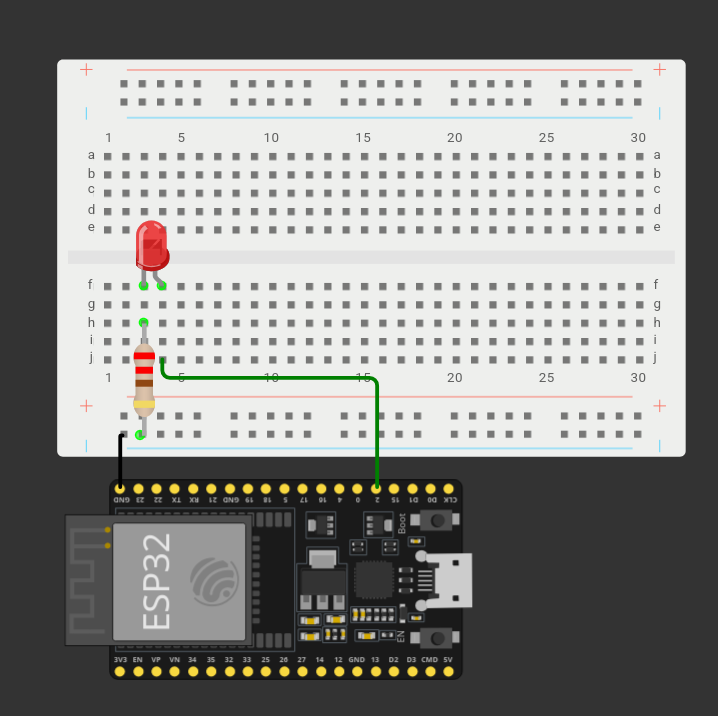

## Introducción

El siguiente paso es controlar el led de siempre por medio de la conexión BLE de la esp32.

## Circuito

El de siempre con un led y su resistencia, todo al `GPIO16`.

## Código

Procedemos a cargar en la esp32 el siguiente código:

```cpp
#include <BLEDevice.h>
#include <BLEServer.h>
#include <BLEUtils.h>
#include <BLE2902.h>

// UUIDs del servicio Nordic UART-like
#define SERVICE_UUID           "6E400001-B5A3-F393-E0A9-E50E24DCCA9E"
#define CHARACTERISTIC_UUID_RX "6E400002-B5A3-F393-E0A9-E50E24DCCA9E"
#define CHARACTERISTIC_UUID_TX "6E400003-B5A3-F393-E0A9-E50E24DCCA9E"

// Pin del LED
const int led = 16;
bool estado = false;

// Variables globales BLE
BLEServer* pServer = NULL;
BLECharacteristic* pTxCharacteristic = NULL;
bool deviceConnected = false;

// Callback para eventos de conexion/desconexion
class MyServerCallbacks: public BLEServerCallbacks {
  void onConnect(BLEServer* pServer) override {
    deviceConnected = true;
    Serial.println("Dispositivo conectado por BLE");
  }

  void onDisconnect(BLEServer* pServer) override {
    deviceConnected = false;
    Serial.println("Dispositivo desconectado");
    // Reiniciar advertising para permitir nuevas conexiones
    delay(500);
    pServer->startAdvertising();
    Serial.println("Reanudando advertising...");
  }
};

// Callback para recibir datos del cliente
class MyCallbacks: public BLECharacteristicCallbacks {
  void onWrite(BLECharacteristic* pCharacteristic) override {
    // Obtener el valor recibido - esto devuelve String internamente
    String rxValue = pCharacteristic->getValue();

    if (rxValue.length() > 0) {
      Serial.print("Comando recibido: ");
      Serial.println(rxValue.c_str());

      // Procesar comando
      if (rxValue == "H") {
        estado = true;
        digitalWrite(led, HIGH);
        Serial.println("LED encendido");

        // Enviar confirmacion por BLE usando String
        String confirmacion = "OK_ON";
        pTxCharacteristic->setValue(confirmacion.c_str());
        pTxCharacteristic->notify();
      }
      else if (rxValue == "L") {
        estado = false;
        digitalWrite(led, LOW);
        Serial.println("LED apagado");

        String confirmacion = "OK_OFF";
        pTxCharacteristic->setValue(confirmacion.c_str());
        pTxCharacteristic->notify();
      }
      else if (rxValue == "STATUS") {
        String estado = estado ? "LED:ON" : "LED:OFF";
        pTxCharacteristic->setValue(estado.c_str());
        pTxCharacteristic->notify();
      }
      else {
        Serial.print("Comando no reconocido: ");
        Serial.println(rxValue.c_str());
      }
    }
  }
};

void setup() {
  Serial.begin(115200);
  Serial.println();
  Serial.println("Iniciando Servidor BLE");

  // Configurar LED
  pinMode(led, OUTPUT);
  digitalWrite(led, LOW);

  // Inicializar dispositivo BLE, CAMBIAR NOMBRE
  BLEDevice::init("CAMBIAR_NOMBRE");

  // Crear servidor BLE
  pServer = BLEDevice::createServer();
  pServer->setCallbacks(new MyServerCallbacks());

  // Crear servicio
  BLEService* pService = pServer->createService(SERVICE_UUID);

  // Crear caracteristicas
  // Caracteristica TX (envia datos al teléfono) con propiedad NOTIFY
  pTxCharacteristic = pService->createCharacteristic(
    CHARACTERISTIC_UUID_TX,
    BLECharacteristic::PROPERTY_NOTIFY
  );
  pTxCharacteristic->addDescriptor(new BLE2902());

  // Caracteristica RX (recibe datos del teléfono) con propiedad WRITE
  BLECharacteristic* pRxCharacteristic = pService->createCharacteristic(
    CHARACTERISTIC_UUID_RX,
    BLECharacteristic::PROPERTY_WRITE
  );
  pRxCharacteristic->setCallbacks(new MyCallbacks());

  // Iniciar servicio
  pService->start();

  // Iniciar advertising
  BLEAdvertising* pAdvertising = pServer->getAdvertising();
  pAdvertising->start();

  Serial.println("Servidor BLE listo");
  // CAMBIAR AL NOMBRE ELEGIDO
  Serial.println("Nombre del dispositivo: CAMBIAR_NOMBRE");
  Serial.print("Servicio UUID: ");
  Serial.println(SERVICE_UUID);
  Serial.println("Instrucciones:");
  Serial.println("1. Abrir nRF Connect en el teléfono");
  Serial.println("2. Escanear y conectarse a CAMBIAR_NOMBRE");
  Serial.println("3. Buscar la caracteristica con RX en Nordic UART Service");
  Serial.println("4. Presionar el icono de flecha que apunta arriba");
  Serial.println("5. Escribir H (Encender) o L (Apagar)");
}

void loop() {
  // Mantener el servidor funcionando
  // Opcional: parpadeo del LED integrado como indicador de actividad
  static unsigned long lastBlink = 0;
  static bool blinkState = false;

  if (deviceConnected && (millis() - lastBlink > 5000)) {
    lastBlink = millis();
    blinkState = !blinkState;
    // Solo para depuracion, no interfiere con el LED principal
  }

  delay(100);
}
```

Las instrucciones estarán mostrándose en el monitor serial de Arduino IDE.
