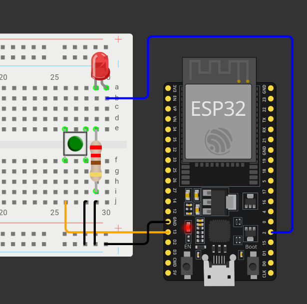

## Circuito

Combinaremos lo aprendido con el led y el botón para controlar al primero con el segundo.



## Código

```cpp
const int boton = 13;
const int led = 2;
int estado_boton = 0;

void setup() {
  Serial.begin(115200);
  pinMode(boton, INPUT_PULLUP);
  pinMode(led, OUTPUT);
}

void loop() {
  int estado_boton = digitalRead(boton);
  if (estado_boton == LOW) {
    Serial.println(estado_boton);
    digitalWrite(led, HIGH);
  }
  else {
    digitalWrite(led, LOW);
  }
}
```
