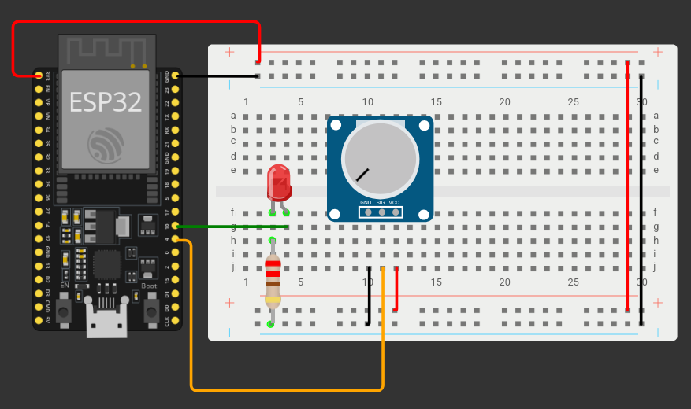

```cpp
int led = 16;
int pot = 4;
int valorpot = 0;
int valorled = 0;

void setup()
{
  Serial.begin(9600);
}

void loop()
{
  valorpot = analogRead(pot);
  valorled = map(valorpot, 0, 4095, 0, 255);
  analogWrite(led, valorled);
  Serial.print("Lectura del pot = ");
  Serial.print(valorpot);
  Serial.print("\t Brillo del led = ");
  Serial.println(valorled);
  delay(2);
}
```
