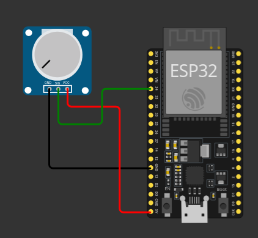

## Circuito

Realizaremos la lectura de los valores de un potenciómetro. Es importante saber que este es un dispositivo analógico, por lo que la lectura sí permite valores graduales (no solamente unos y ceros).

void setup() // Se ejecuta cada vez que el Arduino se inicia
{
  pinMode(34, INPUT);
  Serial.begin(115200); //Inicia comunicación serial
  delay(1000);
}
//------------------------------------
//Funcion cíclica
//------------------------------------
void loop() // Esta funcion se mantiene ejecutando
{
 // cuando este energizado el Arduino
//Guardar en una variable entera el valor del potenciómetro 0 a 1023
int valor = analogRead(34);
//Imprime en la consola serial el valor de la variable
Serial.println(valor);
//Retardo para la visualización de datos en la consola
delay(500);
}
