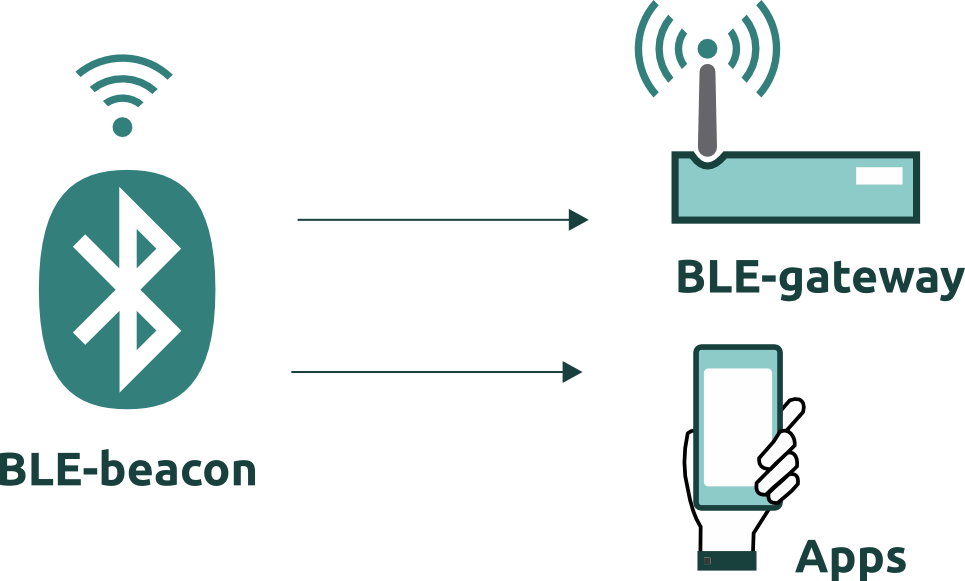

## Introducción

En esta práctica haremos que la esp32 permanezca emitiendo paquetes de datos por medio de Bluetooth Low Energy (BLE) para que un dispositivo móvil los pueda leer. Es como un aviso de proximidad.

## Circuito

El led con resistencia de toda la vida.

## Código

Cargaremos el siguiente código a la esp32. Debemos editarlo para poner nuestro propio *UUID* (podemos generarlo [aquí](https://www.uuidgenerator.net/));
