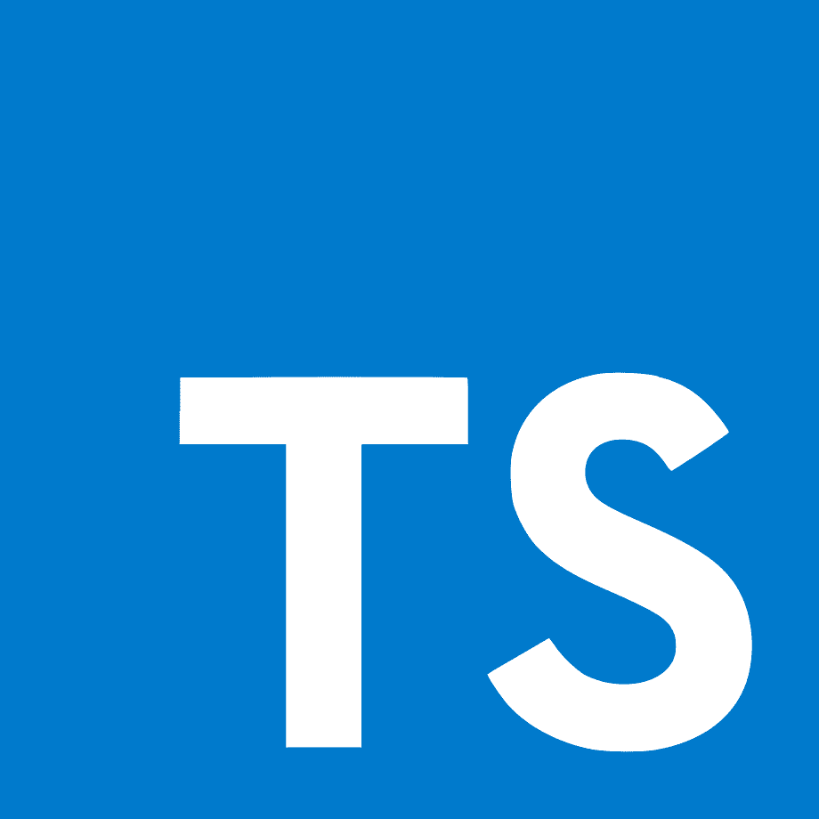

No me detendré mucho en el porqué de utilizar TypeScript en lugar de JavaScript (bueno, son lo mismo a final de cuentas, ¿no?), así que a lo que vamos.

## Instalando

Vamos a preparar nuestro entorno de desarrollo en Manjaro, por lo que los pasos son básicamente los mismos para Arch y derivadas, y con ciertas diferencias son válidas para cualquier distribución Linux.

Primero instalaremos `Node.js` y `npm`:

```bash
sudo pacman -S nodejs npm
```

y probamos las respectivas instalaciones con:

```bash
node -v
```

```bash
npm -v
```

Quizá `zsh` nos pregunte si queremos referirnos a otras aplicaciones con `node` o `npm`. Tranquilamente le diremos que no. Debería devolvernos la versión instalada de ambas aplicaciones.

## Configurando Kate

No es un secreto que todo lo hago en Kate (incluso este blog está hecho ahí), por lo que el paso natural es configurar este IDE para JavaScript. Pasemos a ello.

En la terminal escribimos lo siguiente:

```bash
sudo npm install -g typescript-language-server typescript
```

Si todo ha salido bien, nos indicará cuántos paquetes se instalaron (deberían ser 2, por ejemplo).

Hecho esto, toca asegurarnos de que Kate tenga habilitados los servidores LSP. Se hace fácil, vamos a *Preferencias -> Configurar Kate*, buscamos la categoría *Complementos* y activamos *Cliente LSP*. Luego, en la categoría *Cliente LSP* que aparece, nos aseguramos de activar *Formatear al guardar*.

## Creando nuestro Hola Mundo

Crearemos una carpeta en la ubicación que deseemos y dentro creamos un archivo llamado `index.html`, ya que haremos pruebas de momento en el navegador. Editaremos este archivo escribiendo en él lo siguiente:

```html
<script>
    alert('Hola Mundo')
</script>
```

Guardamos y abrimos el archivo ahora con un navegador. Debería aparecer el aviso. Listo, ya hicimos "algo" en JavaScript. Podemos notar que para ejecutar código en nuestro html basta con "encerrarlo" entre las etiquetas `<script>` y `</script>`.

## Variables

JavaScript maneja algunos tipos de variables, de los cuales resaltaremos el booleano, los números y los textos (las cadenas). Debemos tener en cuenta que el tipo es dinámico, lo que significa que podemos cambiarlo en cualquier momento pero no deberíamos hacerlo.

Para declarar una variable basta con poner su nombre y el valor que tendrá, aunque también podemos usar la palabra reservada `let`. Quitemos el aviso `alert('Hola Mundo')` del campo `<script>` y cambiemos el código por:

```typescript
// Esto es un comentario
edad = 50;

// Para mostrar algo en consola
console.log(edad);
```

Podemos acceder a la consola en Firefox mediante el atajo . Ahí deberíamos poder ver el valor asignado a la variable `edad`.

## Ir más allá

Todo el código que hemos usado lo colocamos dentro de un archivo `index.html`. Sin embargo, no es la mejor práctica, así que ahora lo haremos por separado. Creamos otra carpeta y le llamamos `operaciones`. Dentro de la misma creamos otro archivo `index.html` pero además le agregamos uno llamado `script.js`. Haremos la referencia dentro del html con la línea:

```html
<script src="script.js"></script>
```

Recordemos que los operadores aritméticos en JavaScript son suma `+`, resta `-`, multiplicación `*`, división `/` y módulo `%`.

Dentro del archivo `js` pondremos las siguientes variables:

```typescript
// Suma
let a = 2 + 3;
console.log(a);

// Resta
let x = 10 - 5;
console.log(x);

// Multiplicación
let precio = 10;
let unidades = 5;
let total = precio * unidades;
console.log(total)

// División
let n = 10;
let dividido = n / 2;
console.log(dividido);
```

Abrimos la consola y podremos ver los resultados (5, 5, 50 y 5). Listo, ya sabemos crear páginas web con TypeScript (¿o era JavaScript?).

